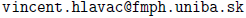

## Rozvrh
<table style="width: 75%;"><tbody><tr><td style="vertical-align:top; width: 25%;" markdown="1">
* **Prednášky**: 
pondelok, 9:50 &ndash; 11:20, poslucháreň F1 
</td>
<td style="vertical-align:top; width: 25%;" markdown="1">  
* **Cvičenia**: 
utorok, 9:50 &ndash; 11:20, miestnosť I-H6
</td>
<td style="vertical-align:top; width: 25%;" markdown="1">
* Konzultácie po dohode mailom
</td></tr></tbody></table>

## Kontakt na vyučujúcich

<table style="width: 75%;"><tbody><tr><td style="vertical-align:top; width: 25%;" markdown="1">
* [Peter Kostolányi](http://www.dcs.fmph.uniba.sk/~kostolanyi/) (prednášky): 
miestnosť M-251 

</td></tr>
<tr><td style="vertical-align:top; width: 25%;" markdown="1">
* Vincent Hlaváč (cvičenia): 
miestnosť M-249 
 
</td>
<td style="vertical-align:top; width: 25%;" markdown="1">
* Matúš Matok (cvičenia): 
miestnosť M-249 
 
</td>
<td style="vertical-align:top; width: 25%;" markdown="1">
* Andrej Ravinger (cvičenia): 
miestnosť M-249 
 
</td>
</tr></tbody></table>
* ***Hromadná adresa zo zimného semestra v letnom semestri nefunguje!***

## Oznamy

<h4><strong>15. februára 2026, 13:00</strong></h4>

Študenti zapísaní na predmet, ktorí úspešne absolvovali prerekvizitu <i>Programovanie (1) v C/C++</i>, sa môžu prihlásiť na testovači s prihlasovacími údajmi rovnakými ako v zimnom semestri.

